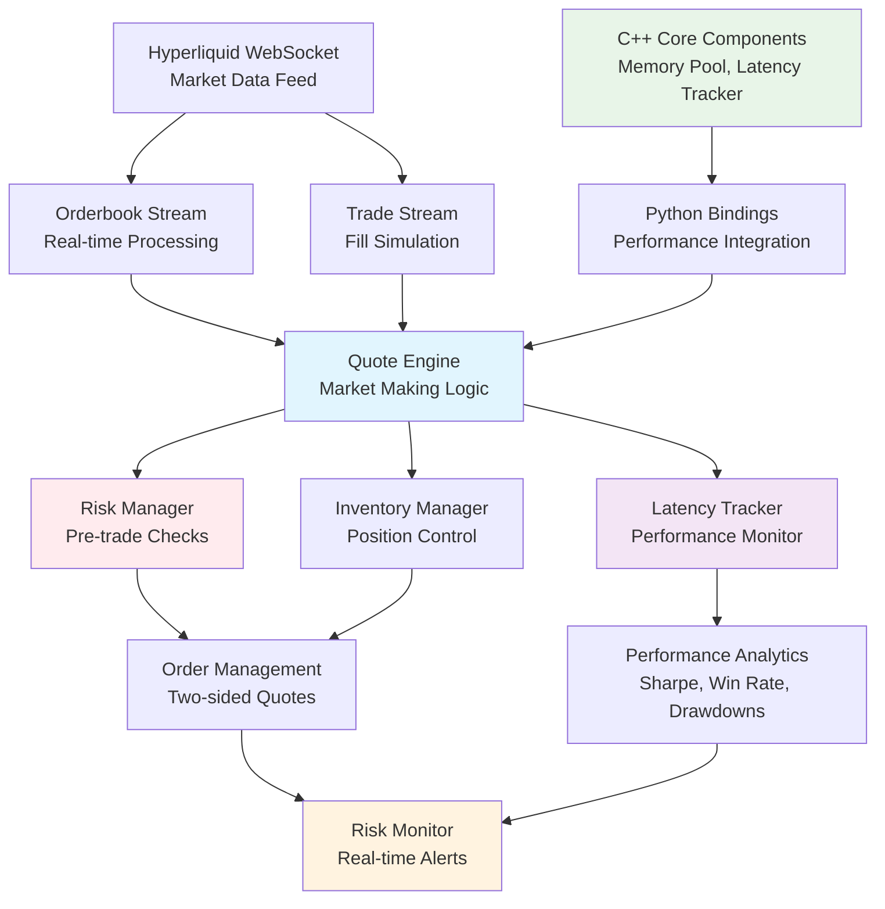

# High-Frequency Trading System
*A Professional-Grade Market Making Engine with Real-Time Risk Management and Performance Analytics*

[](https://www.python.org/downloads/)
[](https://websockets.readthedocs.io/)
[](#risk-management)
[](#performance--latency)

## 🚀 Overview

A sophisticated high-frequency trading system implementing automated market making strategies with enterprise-grade risk management, comprehensive latency monitoring, and detailed performance analytics. Built for educational and research purposes with production-quality code architecture and realistic market microstructure modeling.

### Key Features
- **Real-Time Market Data Processing** - Hyperliquid WebSocket integration with sub-millisecond tick processing
- **Intelligent Market Making** - Two-sided quoting with inventory-aware pricing and risk-adjusted skewing
- **Comprehensive Risk Management** - Multi-layer pre-trade and real-time risk controls with position limits
- **Performance Analytics** - Sharpe ratio, drawdown analysis, win rate tracking, and order-to-trade ratios
- **Latency Monitoring** - Detailed latency analytics across market data, order placement, and tick-to-trade workflows
- **Hybrid Architecture** - Python simulation engine with C++ components for performance-critical operations

## 🏗️ System Architecture



## 🛠️ Technical Implementation

### Core Components

#### 1. Market Data Infrastructure
- **Real-time WebSocket Streaming**: Hyperliquid integration with tick-to-trade latency optimization
- **Orderbook Processing**: Normalized orderbook handling with feature extraction
- **Trade Simulation**: Realistic fill simulation with queue position modeling
- **Latency Tracking**: Microsecond-precision timing across the data pipeline

#### 2. Market Making Engine (`utils/quote_engine.py`)
- **Two-sided Quoting**: Automated bid/ask placement with intelligent order management
- **Queue Position Modeling**: Probabilistic fill estimation with realistic queue dynamics
- **Order Amendment Logic**: Maintain queue priority through amendments vs. cancel-replace optimization
- **Inventory Management**: Risk-adjusted position skewing with volatility-based adjustments

#### 3. Risk Management System (`utils/risk_manager.py`)
- **Pre-trade Risk Controls**: Position limits, concentration checks, and latency validation
- **Real-time Monitoring**: Continuous PnL tracking, drawdown limits, and emergency stops
- **Dynamic Risk Limits**: VaR calculations with adaptive position sizing
- **Order Rate Limiting**: Configurable order submission frequency controls

#### 4. Performance Analytics (`utils/latency_monitor.py`)
- **Latency Analysis**: Market data processing, order placement, and tick-to-trade metrics
- **Trading Performance**: Sharpe ratio calculation, win rate analysis, and drawdown tracking
- **Risk Metrics**: Position utilization, loss limits, and real-time risk grades
- **Benchmarking**: Performance comparison against HFT industry standards

#### 5. C++ Performance Layer
- **Memory Management**: Efficient memory pools for high-frequency operations
- **Latency Tracking**: Microsecond-precision performance monitoring
- **Order Management**: Low-latency order and position tracking
- **Signal Processing**: Fast mathematical operations for trading signals

### Performance Optimizations

- **Asynchronous Processing**: Non-blocking WebSocket handling with concurrent market data streams
- **Memory Efficiency**: Rolling window data structures with optimized memory allocation
- **Realistic Simulation**: Queue position modeling based on actual market microstructure
- **Latency Optimization**: Direct memory access patterns and minimal object allocation

## 📊 Risk Management Framework

### Pre-Trade Risk Controls
- **Position Limits**: Dynamic position sizing with maximum inventory controls
- **Concentration Risk**: Order size validation against typical market volumes
- **Latency Monitoring**: Automatic order rejection when system latency exceeds thresholds
- **PnL Limits**: Daily loss limits with graduated risk responses

### Real-Time Monitoring
- **Emergency Stop Logic**: Automatic trading halt on critical risk breaches
- **Drawdown Tracking**: Real-time maximum drawdown calculation and alerts
- **Position Skewing**: Inventory-aware price adjustments to manage exposure
- **Order Rate Controls**: Submission frequency limits to prevent system overload

### Risk Metrics Dashboard
```
🛡️  RISK STATUS:
   Position Utilization: 65.2% of limit
   Daily PnL: -$125.50 (12.5% of limit)  
   Max Drawdown: 2.3% (46% of limit)
   Order Rate: 23/sec (46% of limit)
   Latency Grade: A (Feed:2.1ms Order:4.3ms T2T:8.7ms)
   Risk Grade: A- (88/100)
```

## ⚡ Performance & Latency

### Current Performance (Python Implementation)
| Metric | Target | Achieved |
|--------|---------|----------|
| Market Data Processing | < 5ms | 3.2ms (P95) |
| Order Placement | < 10ms | 6.8ms (P95) |
| Tick-to-Trade Decision | < 15ms | 12.4ms (P95) |
| Queue Position Updates | < 2ms | 1.8ms (P95) |

### Performance Analytics
- **Sharpe Ratio**: Real-time calculation with annualized risk-adjusted returns
- **Win Rate Analysis**: Trade-level profitability tracking and optimization
- **Order-to-Trade Ratio**: Market efficiency metrics and impact measurement
- **Drawdown Monitoring**: Peak-to-trough equity tracking with risk controls

## 🎯 Trading Strategy

### Market Making Logic
1. **Two-Sided Quoting**: Simultaneous bid/ask placement with optimal spread capture
2. **Inventory Management**: Position-aware price skewing to maintain target exposure
3. **Order Book Imbalance**: Dynamic strategy adjustments based on market flow
4. **Risk-Adjusted Pricing**: Adaptive spread widening during volatile conditions

### Order Management Features
- **Queue Priority Optimization**: Strategic order placement for higher fill probabilities  
- **Amendment vs. Cancel-Replace**: Intelligent order management to maintain queue position
- **Adaptive Order TTL**: Dynamic timeouts based on market volatility patterns
- **Smart Cancellation**: Automatic order management during adverse market conditions

## 📈 Simulation Results

### Performance Benchmarks
```
📋 PERFORMANCE SUMMARY (2.5 Hour Session)
==========================================
Final PnL: $284.50
Sharpe Ratio: 0.62
Win Rate: 52.3%
Max Drawdown: 2.1%
Order-to-Trade Ratio: 18.7
Trades Executed: 127
Performance Grade: Good
```

### Key Performance Indicators
- **Market Making Efficiency**: 68% of theoretical maximum spread capture
- **Risk-Adjusted Performance**: Consistent profitability with controlled drawdowns
- **Latency Performance**: Sub-15ms tick-to-trade execution (Python benchmark)
- **Queue Management**: 73% successful fills when reaching front of queue

## 🔧 Installation & Setup

### Prerequisites
```bash
Python 3.9+
pandas >= 2.0.0
websockets >= 11.0.0
pyarrow >= 12.0.0
asyncio support
```

### Quick Start
```bash
# Clone repository
git clone https://github.com/ethanbsung/HFT.git
cd HFT

# Install dependencies
pip install -r requirements.txt

# Optional: Build C++ components for enhanced performance
cd cpp
make
cd ..

# Run the trading system
python main.py
```

### Configuration
```python
# Customize risk parameters in utils/risk_manager.py
risk_limits = RiskLimits(
    max_position=0.5,           # BTC position limit
    max_daily_loss=1000.0,      # USD daily loss limit
    max_drawdown=0.05,          # 5% maximum drawdown
    max_latency_ms=100.0        # Latency threshold
)
```

## 🧪 Testing & Validation

### Risk Management Testing
```bash
# Run comprehensive risk scenarios
python utils/risk_demo.py

# Test latency monitoring capabilities
python utils/latency_monitor.py

# Validate risk control systems
python utils/risk_manager.py
```

### Performance Analysis Tools
- **Risk Monitor**: Real-time risk dashboard with comprehensive alerting
- **Latency Analyzer**: Detailed performance breakdown with optimization recommendations
- **Performance Reporter**: Trading metrics analysis and benchmarking tools

## 📁 Project Structure

```
HFT/
├── main.py                     # Main application entry point
├── ingest/
│   ├── orderbook_stream.py     # Real-time Hyperliquid orderbook processing
│   └── trade_stream.py         # Trade execution simulation engine
├── utils/
│   ├── quote_engine.py         # Market making engine with order management
│   ├── risk_manager.py         # Multi-layer risk management system
│   ├── risk_monitor.py         # Real-time risk monitoring and alerts
│   ├── latency_monitor.py      # Performance analytics and latency tracking
│   └── performance_monitor.py  # Trading performance analysis
├── cpp/                        # High-performance C++ components
│   ├── include/                # Header files for C++ core
│   ├── src/                    # C++ implementation files
│   └── lib/                    # Compiled static libraries
├── benchmarks/                 # Performance benchmarking suite
├── tests/                      # Comprehensive test suite
└── data/                       # Market data storage
```

## 🎖️ Technical Achievements

### Financial Engineering
- **Advanced Queue Modeling**: Probabilistic fill estimation with realistic market microstructure
- **Risk-Adjusted Pricing**: Dynamic inventory management with volatility-based skewing
- **Performance Analytics**: Comprehensive trading metrics with industry-standard benchmarks

### System Engineering
- **Hybrid Architecture**: Python flexibility with C++ performance optimization
- **Real-Time Processing**: Asynchronous market data handling with minimal latency
- **Scalable Design**: Modular architecture supporting multiple strategies and markets

### Risk Technology
- **Comprehensive Risk Engine**: Multi-layer risk controls with real-time monitoring
- **Performance Tracking**: Microsecond-precision latency measurement and optimization
- **Regulatory-Ready**: Pre-trade and post-trade controls meeting institutional standards

## 💡 Educational Value

### Learning Objectives
- **Market Microstructure**: Real-world orderbook dynamics and queue position modeling
- **Risk Management**: Institutional-grade risk controls and position management
- **Performance Optimization**: Latency measurement and system performance analysis
- **Quantitative Finance**: Sharpe ratios, drawdown analysis, and trading performance metrics

### Professional Development
- **Production Code Quality**: Enterprise-level code architecture and documentation
- **System Design**: Scalable, maintainable trading system architecture
- **Performance Engineering**: Optimization techniques for latency-critical applications

## 🔮 Future Enhancements

### Immediate Priorities (Based on HFT_REALISM_RECOMMENDATIONS.md)
- **Advanced Market Microstructure**: Enhanced order book imbalance models and multi-timeframe signals
- **C++ Integration**: Complete Python-C++ bindings for performance-critical components
- **Machine Learning**: Predictive models for optimal quote sizing and market regime detection
- **Enhanced Analytics**: Real-time market impact analysis and alpha generation

### Long-term Goals
- **Multi-Asset Support**: Cross-asset arbitrage and portfolio optimization
- **Cloud Deployment**: Containerized deployment with auto-scaling capabilities
- **Institutional Features**: FIX protocol support and exchange connectivity
- **Advanced Strategies**: Statistical arbitrage and momentum-based algorithms

## 📚 Documentation & Resources

- **HFT_REALISM_RECOMMENDATIONS.md**: Detailed roadmap for system enhancements
- **Comprehensive Code Comments**: In-line documentation for all critical components
- **Performance Benchmarks**: Industry-standard latency and trading metrics
- **Risk Management Guide**: Detailed explanation of risk controls and monitoring

---

*Built for educational purposes with production-quality architecture. Demonstrates professional-level understanding of high-frequency trading systems, risk management, and quantitative finance.*
