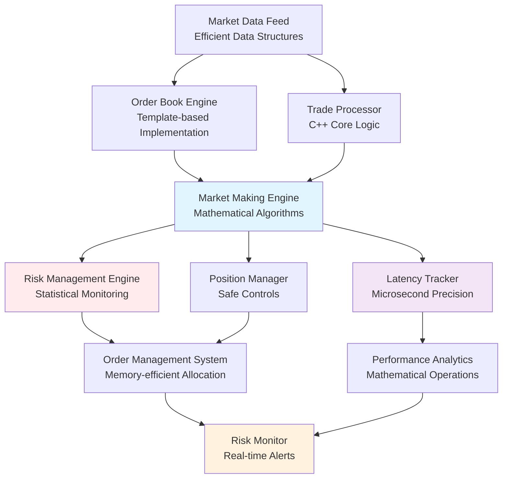

# High-Frequency Trading System in C++
*A Professional-Grade Market Making Engine with Real-Time Risk Management - Currently in Development*

[](https://isocpp.org/)
[](https://cmake.org/)
[](#development-status)
[](#risk-management-engine)

## 🚀 Overview

A sophisticated high-frequency trading system implementing automated market making strategies with comprehensive risk management and microsecond-precision latency monitoring. **Currently being developed in modern C++** to demonstrate production-quality quantitative finance system architecture and advanced C++ programming techniques.

### Planned Core Features
- **High-Performance Market Making** - Template-based order book with efficient data structures
- **Real-Time Risk Management** - Statistical risk engine with atomic operations and monitoring
- **Microsecond Latency Tracking** - Custom memory pools and optimized mathematical operations
- **Advanced Market Microstructure** - Probabilistic queue modeling and inventory-aware pricing algorithms
- **Modern C++ Architecture** - Leveraging C++17 features for type safety and performance optimization

## 🏗️ System Architecture (Target Design)



## 🛠️ Technical Implementation

### Core Components (In Development)

#### 1. Market Data Infrastructure (`cpp/src/data_feed/`)
- **Efficient Data Processing**: High-throughput market data ingestion with optimized memory usage
- **Template-based Order Book**: Type-safe, compile-time optimized order book implementation
- **Trade Processing**: Safe trade execution with proper error handling
- **Memory Management**: Custom allocators for low-latency object creation

#### 2. Market Making Engine (`cpp/src/market_maker/`)
- **Mathematical Pricing Models**: Statistical algorithms for optimal bid/ask calculation
- **Inventory Management**: Real-time position tracking with risk-adjusted skewing
- **Queue Position Modeling**: Probabilistic fill estimation using statistical methods
- **Order Management Logic**: Sophisticated order handling with queue priority optimization

#### 3. Risk Management Engine (`cpp/src/risk_engine/`)
- **Statistical Risk Monitoring**: VaR calculations with rolling window statistics
- **Position Controls**: Real-time position limits and concentration checks
- **PnL Tracking**: Precise profit/loss calculation with proper numerical handling
- **Dynamic Risk Adjustment**: Adaptive position sizing based on market conditions

#### 4. Performance Analytics (`cpp/src/analytics/`)
- **Latency Measurement**: High-resolution timing across critical system paths
- **Mathematical Operations**: Efficient implementation of financial calculations
- **Data Structure Optimization**: Memory-efficient containers for high-frequency data
- **Statistical Analysis**: Performance measurement and system diagnostics

### Current C++ Implementation Focus

#### Modern C++ Features (C++17)
```cpp
// Type safety with concepts-style programming
template<typename T>
requires std::is_arithmetic_v<T>
class OrderBook {
    // Type-safe order book implementation
};

// Structured bindings for clean financial calculations
auto [bid, ask, spread] = calculate_optimal_quotes(market_data);

// std::optional for safer order management
std::optional<Order> try_place_order(const OrderRequest& request);
```

#### Performance Optimization Techniques
```cpp
// Custom allocators for trading objects
class OrderAllocator {
    // Memory pool allocation for order objects
};

// Efficient mathematical calculations
void calculate_portfolio_metrics(const std::vector<Position>& positions);

// Template specializations for different instruments
template<>
class PricingModel<EquityInstrument> {
    // Specialized pricing for equity instruments
};
```

## 📊 Development Status

### ✅ Completed Components
- **Project Structure**: Modern CMake build system with proper organization
- **Core Types**: Fundamental data structures and type definitions
- **Basic Infrastructure**: Memory management and utility classes
- **Mathematical Foundation**: Statistical calculation framework

### 🔄 Currently Implementing
- **Latency Tracking System**: Microsecond-precision performance monitoring
- **Order Book Engine**: Efficient limit order book with proper market microstructure
- **Risk Management Core**: Statistical risk calculations and position monitoring
- **Market Making Logic**: Pricing algorithms and inventory management

### 📋 Planned Features
- **Advanced Risk Models**: Sophisticated portfolio risk management
- **Performance Optimization**: SIMD operations and cache-friendly data structures
- **Enhanced Analytics**: Comprehensive trading performance measurement
- **Integration Layer**: Python bindings for visualization and analysis

## 🎯 Current Trading Algorithm Development

### Market Making Strategy (In Progress)
```cpp
class MarketMaker {
    // Pricing model with inventory consideration
    QuotePair calculate_quotes(const MarketData& data, 
                              const InventoryState& inventory);
    
    // Queue position estimation
    double estimate_fill_probability(const Order& order, 
                                   const OrderBookState& book);
    
    // Risk-adjusted position sizing
    OrderSize calculate_order_size(const RiskMetrics& risk);
};
```

### Mathematical Models (Under Development)
- **Statistical Analysis**: Mean reversion models with significance testing
- **Risk Calculation**: Portfolio risk metrics and position limits
- **Performance Metrics**: Sharpe ratio and drawdown analysis
- **Signal Processing**: Market indicator calculation and trend analysis

## 📁 Project Structure

```
HFT/
├── cpp/                        # Core C++ implementation
│   ├── CMakeLists.txt         # Modern CMake build system
│   ├── include/               # Header files
│   │   ├── types.hpp          # ✅ Core type definitions
│   │   ├── memory_pool.hpp    # ✅ Memory management
│   │   ├── latency_tracker.hpp # 🔄 Performance monitoring
│   │   ├── orderbook_engine.hpp # 🔄 Order book implementation
│   │   ├── signal_engine.hpp   # 📋 Trading signal processing
│   │   └── order_manager.hpp   # 📋 Order management system
│   ├── src/                   # Implementation files
│   │   ├── memory_pool.cpp    # ✅ Memory pool implementation
│   │   ├── latency_tracker.cpp # 🔄 Latency tracking system
│   │   ├── orderbook_engine.cpp # 🔄 Order book logic
│   │   ├── signal_engine.cpp   # 📋 Signal processing
│   │   └── order_manager.cpp   # 📋 Order management
│   ├── tests/                 # Test suite
│   │   └── test_latency.cpp   # 🔄 Latency tracker tests
│   └── lib/                   # External dependencies
├── python/                    # Python prototype and utilities
│   ├── utils/                 # Original Python implementation
│   └── bindings/              # 📋 Future Python bindings
├── data/                      # Market data storage
└── examples/                  # Usage examples and demos
```

**Legend**: ✅ Complete | 🔄 In Progress | 📋 Planned

## 🎖️ Technical Learning Objectives

### Quantitative Finance Implementation
- **Order Book Modeling**: Efficient limit order book with realistic market dynamics
- **Statistical Risk Management**: Real-time risk calculation with mathematical models
- **High-Frequency Algorithm Design**: Microsecond-precision trading algorithms

### Advanced C++ Programming
- **Memory Management**: Custom allocators and memory pools for performance
- **Template Programming**: Generic programming techniques for financial applications
- **Performance Optimization**: Efficient algorithms and data structure design
- **Modern C++ Features**: Leveraging C++17 for clean, efficient code

### Software Architecture
- **System Design**: Scalable architecture for high-frequency trading systems
- **Performance Engineering**: Latency optimization and real-time constraints
- **Testing Strategy**: Comprehensive testing for financial applications
- **Documentation**: Technical documentation for complex systems

## 💡 Development Approach

### Implementation Strategy
- **Incremental Development**: Building core components systematically
- **Performance Focus**: Optimizing critical paths for low latency
- **Type Safety**: Leveraging C++ type system for correctness
- **Testing-Driven**: Comprehensive testing at each development stage

### Learning Goals
- **Market Microstructure**: Understanding order book dynamics and trading mechanics
- **Risk Management**: Implementing institutional-grade risk controls
- **Performance Engineering**: Optimizing C++ code for high-frequency applications
- **System Architecture**: Designing scalable, maintainable trading systems

## 🔮 Development Roadmap

### Phase 1: Core Infrastructure (Current)
- **Latency Tracking**: Complete microsecond-precision timing system
- **Order Book Engine**: Implement efficient limit order book
- **Basic Risk Management**: Position tracking and limit enforcement
- **Mathematical Libraries**: Statistical functions and calculations

### Phase 2: Trading Logic (Next)
- **Market Making Engine**: Automated quote generation and management
- **Risk Integration**: Advanced risk models and real-time monitoring
- **Performance Analytics**: Comprehensive trading metrics
- **Order Management**: Sophisticated order handling and execution

### Phase 3: Advanced Features (Future)
- **Optimization**: SIMD operations and advanced performance tuning
- **Integration**: Python bindings for analysis and visualization
- **Testing**: Comprehensive test suite and benchmarking
- **Documentation**: Complete technical documentation

---

*A C++ quantitative finance project demonstrating advanced programming techniques, mathematical modeling, and high-performance system design. Currently in active development with focus on modern C++ implementation and financial algorithm design.*
